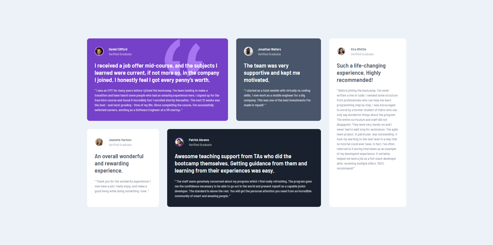

# Frontend Mentor - Testimonials grid section solution

This is a solution to the [Testimonials grid section challenge on Frontend Mentor](https://www.frontendmentor.io/challenges/testimonials-grid-section-Nnw6J7Un7). Frontend Mentor challenges help you improve your coding skills by building realistic projects. 

## Table of contents

- [Overview](#overview)
  - [The challenge](#the-challenge)
  - [Screenshot](#screenshot)
  - [Links](#links)
- [My process](#my-process)
  - [Built with](#built-with)
  - [What I learned](#what-i-learned)
  - [Continued development](#continued-development)

## Overview

### The challenge

- Recreate the testimonal section as accurately as possible to the design spec provided, making use of CSS grid
- View the optimal layout for the site depending on their device's screen size

### Screenshot



### Links

- Live Site URL: https://aidenm99.github.io/Testimonial-Section/

## My process

### Built with

- Semantic HTML5 markup
- CSS custom properties
- Flexbox
- CSS Grid

### What I learned

- How to use CSS grid to achieve my desired layout

```css
.grid {
  display: grid;
  grid-gap: 2rem;
  max-width:1500px;
  grid-template-rows: auto;
}
```

- A way of selecting all child elements of a particular element

```css
.grid > div {
  border-radius: 10px;
}
```

- How to use the Z index to change the stacking order of elements 

```css
img {
  z-index:2;
}
```

### Continued development

- I still have a lot to learn about CSS Grid, I plan to build more projects making use of it so that I can learn more of its concepts.
